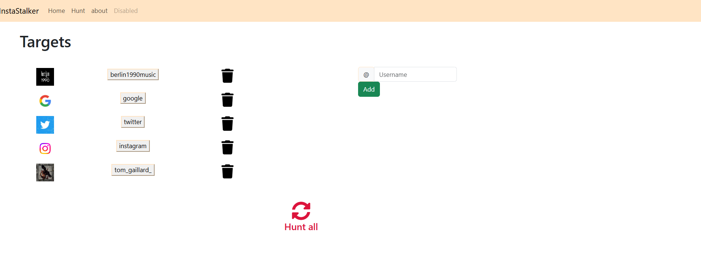
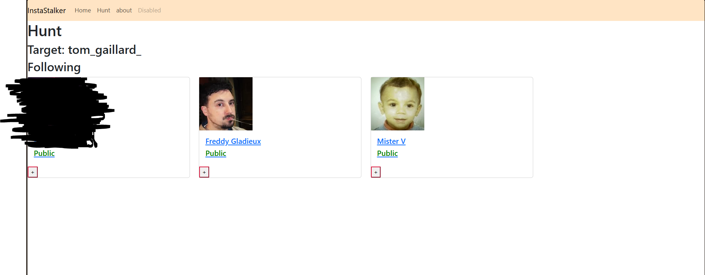

# Instagram Stalker

## What is this ? 

> I wanted to have a OSINT project, so I used burpsuite to map the request from the API and based on it I made the logic to get the following
for a public profile. It will get all the following and add it to a db, when you redo a scan it will tell you the new followings of the target
that we did not see during the previous scan.

## TODO
- A lot more can be improved especially the error handling 
- Loading state after starting scan
- Make a cool huntall page so we can just hunt everyone instead of 1 by 1 

## How To use it ? 

1. **Get cookies from an instagram account on burpsuite and put them in the .env file like so:** 
- burp0_cookies='{"cookie_name": "cookie_value"}'
- burp0_headers='{"header_name": "header_value"}'
- burp0_data='{"data_key": "data_value"}'

2. **Have a mongoDB instance ready to store the result and store the connection string in the .env**
- CONNECTION_STRING='your_mongodb_connection_string'

3. **Install the required dependencies:**
    ```sh
    pip install -r requirements.txt
    ```

3. **Start the app and connect to it on localhost:5000**
    ```sh
    python main.py
    ```
4. **Add a target and click on it to start a scan and add all the following in the DB**

5. **You can then rescan the target to see if he followed anybody since the last scan**

## Interface


## Notes

- Ensure that the MongoDB instance is running and accessible.
- The targets must be public profiles or followed by the account whose cookies are used.
- Handle the environment variables securely and do not expose them publicly.
